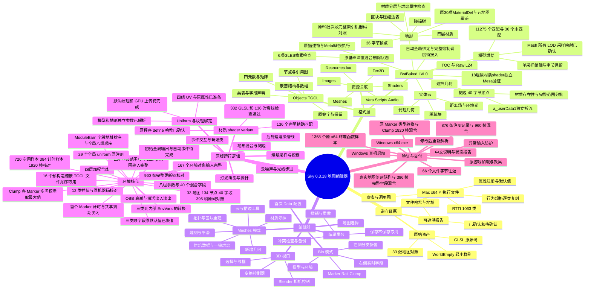

# Sky 地图编辑器思维导图

```mermaid
mindmap
  root((Sky 0.3.18 地图编辑器))
    逆向证据
      Mac x64 可执行文件
        RTTI 1063 类
        虚表与调用图
        属性注册与默认值
        行为规格逐类复刻
      原始资产
        33 张地图对照
        WorldEmpty 最小样例
        GLSL 原源码
      可追溯报告
        文件哈希与地址
        已确认和待确认
    格式层
      Objects TGCL
        类表与字段声明
        节点与引用图
        嵌套结构与数组
        四元数与矩阵
        原始字节保留
      BstBaked LVL0
        TOC 与 Raw LZ4
        模型烘焙
          Mesh 所有 LOD 采样映射已确认
          11275 个匹配与 36 个未匹配
          单采样编辑与字节保留
        地形
          36 字节顶点
          区块与压缩边表
          碰撞树
          四层材质
          原30项MaterialDef与五地图覆盖
          原59批次及完整索引机器码对照
          材质分层与烘焙属性检查
        实体云
          稀疏块
          距离场与环境光
          代理几何
        裙边 40 字节顶点
          a_userData1独立拆流
          材质存在性与完整范围分批
        18组原材质shader独立Mesa验证
        原基础深度混合剔除状态
          原描述符与Metal转换执行
          6项GLES像素检查
        自动全局绑定与完整绘制调度待接入
        遮挡几何
      资源关联
        Resources.lua
        Meshes
        Images
        Tex3D
        Shaders
        Vars Scripts Audio
    编辑器
      首次 Data 配置
      地图选择
      3D 视口
        Blender 相机控制
        选择与线框
        变换控制器
      Bin 模式
        左侧分类折叠
        右侧实时字段
        Marker Rail Clump
        模型与环境
      Meshes 模式
        材质涂抹
        雕刻与平滑
        新增几何
        拓扑与区块重建
        云与裙边工具
        烘焙数据与一键烘焙
      编辑事务
        撤销与重做
        保存不保存取消
        冲突检查与备份
    原版运行逻辑
      材质 shader variant
        原程序 define 哈希已确认
        136 个声明精确匹配
        332 GLSL 和 136 对离线检查通过
      Uniform 与纹理绑定
        模型和地形独立参数已解析
        四组 UV 与原属性已准备
        默认纹理和 GPU 上传待完成
      地形混合与裙边
      云噪声与光线步进
      灯光阴影与探针
      环境核心
        12 类插值与原机器码核对
        OBB 衰减与激活淡入淡出
        四层加权合成
        三类到内部 EnvVars 的转换
        三类缺字段原默认值已恢复
        八组参数与 40 个混合字段
        167 个环境对象输入完整
        960 帧完整更新链核对
        Clump 各 Marker 空间权重取最大值
        首个 Marker 计时与共享到期关闭
        720 空间样本 384 计时样本 1920 帧核对
        134 直接范围与 4 Clump 范围输入完整
        29 个全局 uniform 原注册
        ModuleBarn 字段地址排序与全局八组顺序
        16 个预构造槽按 TGCL 文件顺序取用
        33 地图 134 节点 40 字段 396 帧原码对照
        初始全局输出与自动事件待完成
      烘焙采样与模糊
      后处理渲染管线
      事件交互与玩法类
    验证与交付
      66 个文件字节往返
      修改后重新解析
      1368 个原 x64 环境函数样本
      876 条注册记录与 960 帧混合
      原 Marker 类型转换与 Clump 1920 帧混合
      真实地图创建队列与 396 帧完整字段混合
      异常输入防护
      Windows x64 exe
      Windows 真机启动
      原游戏加载与效果
      中文说明与状态报告
```

推荐执行顺序：逆向证据 → 格式层 → 安全编辑闭环 → 基础类可视化 → 原版渲染和烘焙 → 拓扑/云工具 → 其他玩法类 → 完整验收。
